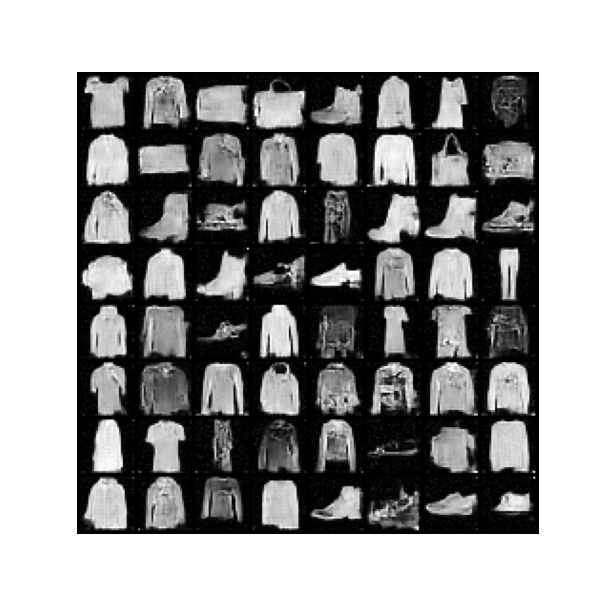
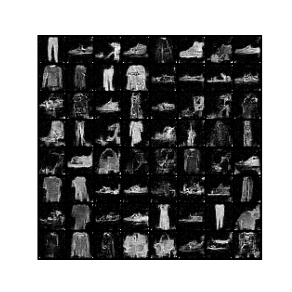
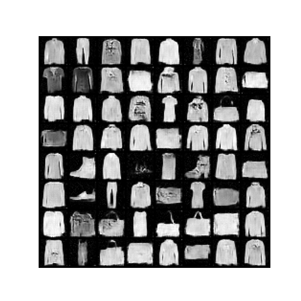

# Score-Based Generative Modeling through Stochastic Differential Equations

Forked from [yang-song/score_sde_pytorch](https://github.com/yang-song/score_sde_pytorch), this repo applies 
Score-Based Generative Modeling on Retinal OCT images.

## Get started

1. Clone the repository
```bash
git clone https://github.com/konkinit/score_sde_pytorch.git
```

2. Install required packages
```bash
pip install -r requirements.txt
pip install --upgrade "jax[cuda11_local]" -f https://storage.googleapis.com/jax-releases/jax_cuda_releases.html
```

3. Load a pretrained checkpoint
```bash
bash get_checkpoint.sh -i 1JInV8bPGy18QiIzZcS1iECGHCuXL6_Nz -p ./exp/ve/cifar10_ncsnpp_continuous/checkpoint.pth
```

## Dataset

The datset used for experiment is Fashion-MNIST, a dataset of Zalando's article images—consisting of a training \
set of 60,000 examples and a test set of 10,000 examples. Each example is a 28x28 grayscale image, associated with \
a label from 10 classes.

## Results

### Score-based model training







### Sampling using SDE


## References

```bib
@inproceedings{
  song2021scorebased,
  title        = {Score-Based Generative Modeling through Stochastic Differential Equations},
  author       = {Yang Song and Jascha Sohl-Dickstein and Diederik P Kingma and Abhishek Kumar and Stefano Ermon and Ben Poole},
  booktitle    = {International Conference on Learning Representations},
  year         = {2021},
  url          = {https://openreview.net/forum?id=PxTIG12RRHS}
}
```

```bib
@online{xiao2017/online,
  author       = {Han Xiao and Kashif Rasul and Roland Vollgraf},
  title        = {Fashion-MNIST: a Novel Image Dataset for Benchmarking Machine Learning Algorithms},
  date         = {2017-08-28},
  year         = {2017},
  eprintclass  = {cs.LG},
  eprinttype   = {arXiv},
  eprint       = {cs.LG/1708.07747},
}
```
